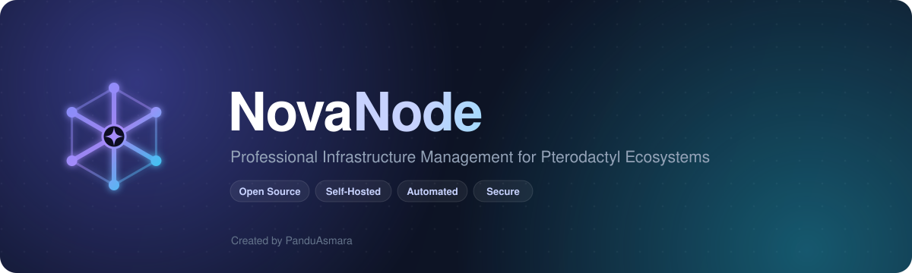

<div align="center">



<br/>

**Control center open-source untuk mengelola seluruh ekosistem Pterodactyl dari satu dashboard.**

[](#-license)


[Fitur](#-fitur) · [Tech Stack](#-tech-stack) · [Mulai Cepat](#-mulai-cepat) · [Roadmap](#-roadmap) · [Keamanan](#-keamanan)

</div>

---

## 🚀 Overview

**NovaNode** adalah platform manajemen infrastruktur yang mengotomatisasi **deployment, monitoring, maintenance,** dan **operasional** ekosistem [Pterodactyl](https://pterodactyl.io). Ia bertindak sebagai _control center_ terpusat — kelola node, allocation, instalasi panel/wings, dan pantau resource hanya dari satu tempat.

Dibangun dengan prinsip: **Simple · Fast · Secure · Automated · Scalable · Open Source.**

> **Untuk siapa?** Hosting Provider · Minecraft Hosting · VPS Provider · Game Hosting · Internal Infrastructure Team · Homelab Enthusiast.

---

## ✨ Fitur

| Modul | Deskripsi |
| --- | --- |
| 🔐 **Authentication** | Setup Wizard (user pertama otomatis `OWNER`), login JWT + refresh token, bcrypt, RBAC 4 peran |
| 📊 **Dashboard** | Ringkasan node, server, allocation, status online/offline, dan resource secara real-time |
| 🖥️ **Node Management** | CRUD node, health check, koneksi SSH terenkripsi per node |
| 🌐 **Allocation Management** | Import, create, bulk, dan delete allocation IP/port |
| 🔌 **Pterodactyl Integration** | Hubungkan panel via Application API Key, sinkronisasi node & allocation |
| ⚙️ **Installer** | One-Click deploy **Panel / Wings** + Update / Repair via SSH, dengan **live log** streaming |
| 🛰️ **Wings Management** | Install, update, restart, remove, health check daemon Wings _(in progress)_ |
| 📡 **Monitoring** | Metrik CPU / RAM / Disk / Network & status service secara real-time _(upcoming)_ |
| 🔔 **Alerting** | Notifikasi Telegram / Discord / Email untuk anomali _(upcoming)_ |

Peran pengguna: **Owner** (akses penuh) · **Admin** (kelola infrastruktur) · **Staff** (monitoring & troubleshooting) · **Viewer** (read-only).

---

## 🧱 Tech Stack

| Layer | Teknologi |
| --- | --- |
| **Frontend** | Next.js · TypeScript · TailwindCSS · shadcn/ui |
| **Backend** | NestJS · TypeScript |
| **Database** | PostgreSQL · Prisma ORM |
| **Queue** | BullMQ · Redis |
| **Provisioning** | SSH (node-ssh) · bash engine idempotent |
| **Monitoring** | Prometheus · Grafana _(optional)_ |
| **Containerization** | Docker · Docker Compose |
| **Monorepo** | pnpm workspaces · Turborepo |

---

## 🗂️ Struktur Repository

```
NovaNode/
├── apps/
│   ├── api/          # NestJS — REST API (/api/v1)
│   ├── web/          # Next.js — Dashboard
│   └── installer/    # Deployment engine (bash builder)
├── packages/
│   ├── database/     # Prisma schema + client
│   ├── sdk/          # Typed API client
│   └── shared/       # Tipe & konstanta bersama
├── docker/           # docker-compose (Postgres + Redis)
├── docs/             # Dokumentasi & aset brand
├── scripts/
├── PRD.md            # Product Requirements Document
└── README.md
```

---

## ⚡ Mulai Cepat

### Prasyarat

- **Node.js** ≥ 20
- **pnpm** ≥ 9 (`corepack enable`)
- **Docker & Docker Compose** (untuk PostgreSQL + Redis)

### Instalasi

```bash
# 1. Install dependencies
pnpm install

# 2. Salin environment variables
cp .env.example .env

# 3. Nyalakan PostgreSQL + Redis
docker compose -f docker/docker-compose.yml up -d

# 4. Generate Prisma client & terapkan skema
pnpm db:generate
pnpm db:push

# 5. Jalankan semua dalam mode dev
pnpm dev
```

| Aplikasi | URL |
| --- | --- |
| 🌐 Web (Next.js) | http://localhost:3000 |
| 🔧 API (NestJS) | http://localhost:4000/api/v1 |

> Saat pertama dijalankan dengan database kosong, NovaNode menampilkan **Setup Wizard** untuk membuat akun pertama (otomatis menjadi `ROLE_OWNER`).

---

## ⚙️ Installer — One-Click Provisioning

Modul **Installer** menyambungkan NovaNode ke host target melalui **SSH** dan menjalankan skrip bash **idempotent** (aman dijalankan berulang) untuk Ubuntu 22.04 / 24.04 & Debian 12:

- **Install Panel** — Nginx · MariaDB · Redis · PHP 8.3 · Pterodactyl Panel
- **Install Wings** — Docker · Wings daemon (+ systemd unit)
- **Update / Repair** — perbarui paket sistem & restart service

Job dieksekusi via **BullMQ** dengan **log streaming langsung** ke UI. Kredensial SSH & API key disimpan **terenkripsi (AES-256-GCM)**.

```
POST /installer/panel | wings | update | repair     # mulai job (Admin)
GET  /installer/logs                                 # riwayat job
GET  /installer/logs/:id                             # detail + log
```

---

## 🗺️ Roadmap

- [x] **Phase 1** — Authentication · Dashboard · Node Management · Allocation Management
- [ ] **Phase 2** — Pterodactyl Integration ✅ · Installer ✅ · Wings Management · Monitoring
- [ ] **Phase 3** — Alerting · Backup Monitoring · Audit Logs
- [ ] **Phase 4** — Multi Panel · Multi Region · Billing Integration

Detail lengkap ada di [PRD.md](./PRD.md).

---

## 🔒 Keamanan

NovaNode menerapkan praktik keamanan secara default:

- 🔑 JWT Authentication + Refresh Token rotation
- 🧂 Password hashing (bcrypt)
- 🔐 Enkripsi kredensial at-rest (SSH secret & API key — AES-256-GCM)
- 🛡️ Helmet · CORS Protection · Rate Limiting
- 📝 Audit Logging

---

## 🤝 Contributing

Kontribusi sangat diterima! Fork repo ini, buat branch fitur, lalu ajukan Pull Request. Pastikan `pnpm typecheck` dan `pnpm build` lolos sebelum mengirim PR.

---

## 📄 License

Dirilis di bawah lisensi **[MIT](https://opensource.org/licenses/MIT)**.

---

<div align="center">

<sub>Built with ❤️ for the Pterodactyl community</sub>

**Created by [PanduAsmara](https://github.com/PanduAsmara)**

</div>
